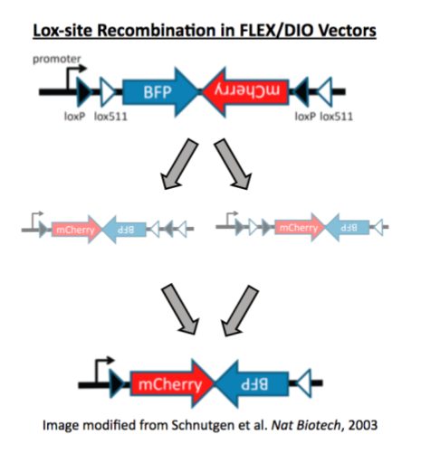
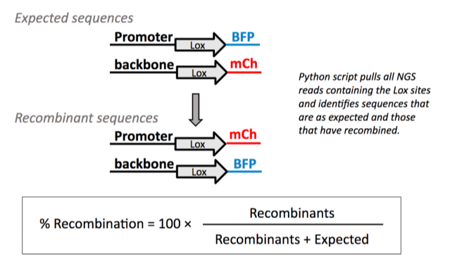

[addgene/openbio/docs](https://addgene.github.io/openbio)
# The Recombination Command
The __recombination__ command helps Addgene’s Research team detect recombination events in viral vectors by analyzing Next Generation Sequencing (NGS) results of the packaged viral genome. The team primarily uses this command to quantify Lox site recombination in FLEX/DIO constructs. In other words, this command can be used to determine the proportion of viral particles that contain recombined Lox sites and thus could direct Cre-independent transgene expression. This is important because a high percentage of recombined lox sites in a viral vector preparation could lead to background transgene expression in experiments.



The recombination command helps Addgene’s Research team detect recombination events in viral vectors by analyzing Next Generation Sequencing (NGS) results of the packaged viral genome. The team primarily uses this command to quantify Lox site recombination in FLEX/DIO constructs. In other words, this command can be used to determine the proportion of viral particles that contain recombined Lox sites and thus could direct cre-independent transgene expression. This is important because a high percentage of recombined lox sites in a viral vector preparation could lead to background transgene expression in experiments.



The command’s parameters can be modified by editing the file `parameters.py` in your favorite text editor.
To change the parameter values, locate the block named `Recombination_Parameters` and follow the examples in the file, paying special attention to the use of double quotes for all text. The parameters are:
* __input_folder__: the folder where the FASTQ files are. Enter the full path or a path relative to the toolkit folder.
* __output_folder__: the folder for the output CSV files. Enter the full path or a path relative to the toolkit folder.
* __HEAD__: the number of bases before the seed sequence
* __TAIL__: the number of bases after the seed sequence
* __seed_sequences__: the name and sequence of the seeds to look for. Add as many as you want, following the example syntax and separated by commas.

You may vary the seed sequences to search for sequences other than Lox sites if you would like to check for recombination at other sites. We use the following seed sequences for our DIO/FLEX vectors, which typically have both LoxP and Lox2272 sites:

Site | Sequence
---- | --------
LoxP | ATAACTTCGTATAGCATACATTATACGAAGTTAT
Lox2272 | ATAACTTCGTATAGGATACTTTATACGAAGTTAT


## Procedure
1. Make sure you have [downloaded](https://github.com/addgene/openbio/archive/master.zip) and expanded the latest code into your Home folder
1. Adjust the parameters for the script by editing the file `parameters.py` as described above.
1. Open a Terminal window and activate your Python environment:
    ```
    workon openbio
    ```
1. Navigate to the toolkit folder:
    ```
    cd openbio-master/toolkit
    ```
1. Issue the following command:
    ```
    python atk.py recombination
    ```
1. When the command finishes, you will find the output CSV files in the folder you selected. The file names reflect the parameters used. For example, the output file:

    `A11984_sW0158_H09_R_001-60-lox2272-60.csv`

    Is the output corresponding to:

    * FASTQ file: `A11984_sW0158_H09_R_001.fastq`
    * HEAD = 60, Seed sequence = lox2272, TAIL = 60
